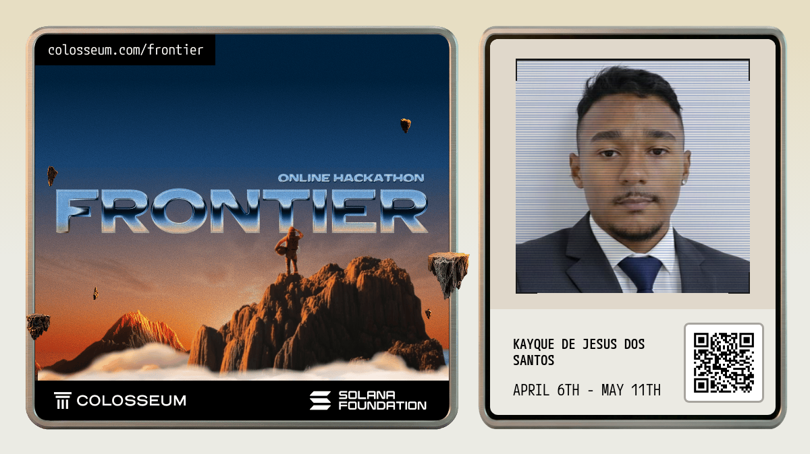

  

  <b>`フルスタック開発者`</b>

  

 

## Social  

Siga-me nas redes sociais para acompanhar meus projetos e conteúdos sobre tecnologia:

## Sobre Mim

Atualmente atuo como **Analista de Sistemas**, sendo responsável pelo desenvolvimento completo de aplicações **(Full Stack)** e pela **implantação de sistemas**, garantindo performance, escalabilidade e estabilidade em ambientes reais.

Tenho cerca de 4 anos de experiência na área de tecnologia, com foco na criação de soluções práticas e eficientes. Possuo versatilidade para trabalhar com diferentes linguagens e tecnologias, adaptando-me conforme a necessidade de cada projeto, atuando tanto no backend quanto no frontend.

Estou me especializando em **Cibersegurança**, aprofundando meus conhecimentos em proteção de sistemas, análise de vulnerabilidades, Pentesting e boas práticas de segurança.

 
 
 

## My Skills

#### Main Stack:

&nbsp;
&nbsp;
&nbsp;
&nbsp;
&nbsp;
&nbsp;
&nbsp;
&nbsp;
&nbsp;

 

## GitHub Stats

   
  
  

 

 

  <picture>
    <source media="(prefers-color-scheme: dark)" srcset="https://raw.githubusercontent.com/kayqueprogram/kayqueprogram/output/github-contribution-grid-snake-dark.svg">
    <source media="(prefers-color-scheme: light)" srcset="https://raw.githubusercontent.com/kayqueprogram/kayqueprogram/output/github-contribution-grid-snake.svg">
    
  </picture>

 

  

 

